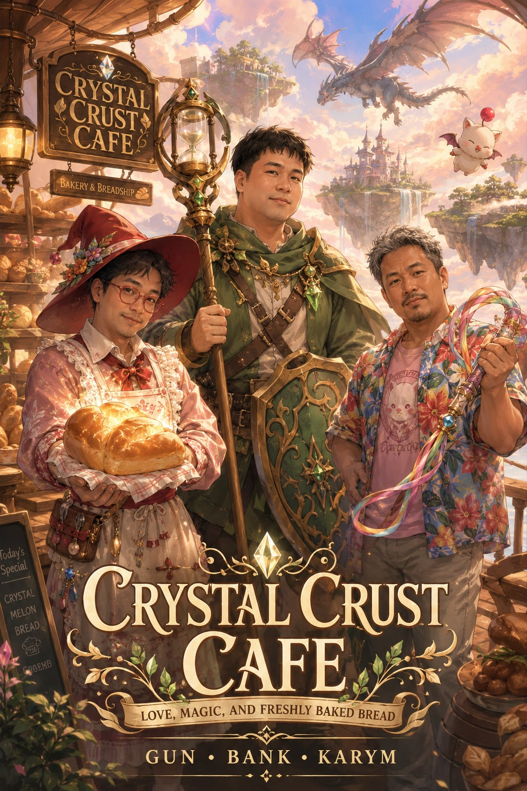

# ☕ Crystal Crust Cafe: ยานบินอบขนมปังกู้โลก (PWA Story App)



ยินดีต้อนรับสู่ **Crystal Crust Cafe** ยานบินอบขนมปังลอยฟ้ากู้โลก! โปรเจกต์นี้เป็นเว็บบอร์ดกึ่งนิยายแนว Cozy-Epic Fantasy และ Romance ของสามหนุ่มพนักงานเบเกอรี่ที่จะมาช่วยกู้โลกในจักรวาล **Final Fantasy V** โดยถูกพัฒนาขึ้นในรูปแบบ **Progressive Web App (PWA)** เพื่อความลื่นไหลสูงสุดและสามารถเปิดอ่านแบบออฟไลน์ได้โดยไม่ต้องเชื่อมต่ออินเทอร์เน็ต

---

## 🌟 จุดเด่นของแอปพลิเคชัน (PWA Features)

* **📶 100% Offline Capability**: ข้อมูลและตัวบทนิยายทั้งหมดถูกรวมเข้าไว้ในไฟล์เพื่อให้อ่านได้ทันทีแม้ไม่มีอินเทอร์เน็ตผ่านการทำงานของ Service Worker
* **📱 Installable**: ติดตั้งเป็นแอปบนหน้าจอมือถือ (Android & iOS) หรือบนเครื่องคอมพิวเตอร์ (Windows & macOS) ได้ด้วยคลิกเดียว
* **🎨 Immersive Reader Overlay**: โหมดอ่านนิยายที่สบายตา ปรับแต่งขนาดตัวอักษรได้ และมีธีมให้เลือกถึง 3 ธีม (Cozy Sepia ☕, Night Theme 🌌, Deep Sea 🌊)
* **💻 Responsive Design**: แสดงผลได้งดงามบนหน้าจอทุกขนาด ตั้งแต่มือถือจอเล็กไปจนถึงหน้าจอคอมพิวเตอร์ความละเอียดสูง

---

## 📖 เนื้อหาภายในแอป

1. **Character Profiles**: วิเคราะห์ข้อมูลตัวละครแบบเจาะลึกของสามตัวเอกหลัก:
   * **กัน (Gun)** - *Chemist / Red Mage* หัวหน้าเชฟผู้ปรุงอาหารและบัฟเบเกอรี่สูตรพิเศษ
   * **แบงค์ (Bank)** - *Time Mage / Merchant* นักบัญชีผู้จัดการงบประมาณและจ่ายกิลสนับสนุนเพื่อนร่วมทีม
   * **การีม (Kareem)** - *Beastmaster / Blue Mage* นักเจรจาผู้ผูกมิตรกับมอนสเตอร์และใช้มนต์รักษาฟื้นฟูทีม
2. **Magic Cafe Menu**: เมนูขนมปังเวทมนตร์ที่ผสมไอเทมในเกม FF5 เช่น *Potion Scone*, *Phoenix Down French Toast* และ *Elixir Curry* 
3. **Story Outline & Chapters**: เนื้อหาบทผจญภัยกู้โลกแบบอุ่นหัวใจที่มีให้อ่านครบถ้วนถึง 39 ตอน

---

## 🛠️ วิธีการเปิดใช้งานเว็บสาธารณะ (Public Web via GitHub Pages)

หากต้องการเปิดให้คนอื่นสามารถเข้ามาเปิดดูและติดตั้งผ่านหน้าเว็บสาธารณะได้ ให้ทำตามขั้นตอนการเปิดใช้ **GitHub Pages** ดังนี้:

1. ตรวจสอบให้มั่นใจว่า Repository ของคุณเปิดเป็น **Public**
2. ไปที่เมนู **Settings** ในหน้าเว็บ GitHub ของโปรเจกต์นี้
3. เลือกหัวข้อ **Pages** ที่เมน้านซ้ายมือ
4. ในหน้าการตั้งค่า GitHub Pages:
   - ภายใต้หัวข้อ **Branch** เลือกเป็น **`main`** และโฟลเดอร์เป็น **`/ (root)`**
   - กดปุ่ม **Save**
5. รอระบบแปลงไฟล์ 1-2 นาที คุณจะได้ลิงก์หน้าเว็บสาธารณะ เช่น `https://superboykk.github.io/FF5KGB/` สำหรับแชร์และใช้งานทันที!

---

## 🏗️ โครงสร้างไฟล์ในโครงการ

```text
├── icons/                  # โฟลเดอร์เก็บไอคอน PWA สำหรับอุปกรณ์ต่างๆ
│   ├── icon-96.png
│   ├── icon-144.png
│   ├── icon-192.png
│   └── icon-512.png
├── chapters/               # โฟลเดอร์เก็บเอกสาร Markdown ของนิยายแต่ละบท (ฉบับร่าง)
├── index.html              # หน้าเว็บหลักของแอป (มีระบบ Immersive Reader และฐานข้อมูลบทนิยาย)
├── manifest.json           # ไฟล์กำหนดค่าแอปพลิเคชันสำหรับติดตั้งเป็น PWA
├── sw.js                   # Service Worker ที่ใช้จัดการการแคชไฟล์เพื่อใช้อ่านออฟไลน์
├── FF5KBG.jpg              # ภาพหน้าปกหลักของโปรเจกต์
└── README.md               # ไฟล์แนะนำโครงการฉบับนี้
```

---

## 🚀 เทคโนโลยีที่เลือกใช้

* **HTML5 & Vanilla CSS**: เพื่อโครงสร้างที่สะอาดตา โหลดได้ไวที่สุด และแสดงผลสไตล์ Glassmorphism
* **Vanilla JavaScript**: เพื่อประสิทธิภาพในการควบคุม UI, การสลับแท็บ และตัวอ่านนิยายโดยปราศจากบล็อกโค้ดส่วนเกิน
* **Service Worker & Cache Storage API**: ตัวขับเคลื่อนระบบออฟไลน์ของ PWA

---
*จัดทำขึ้นโดยทีมกู้ภัยเบเกอรี่ลอยฟ้า Crystal Crust Cafe 🥐✨*
