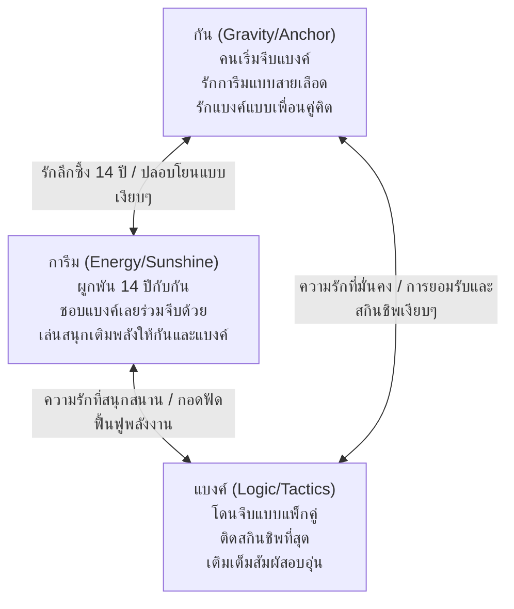

# 🎭 Character Sheets & Throuple Dynamic (Revised v1.4 - Cozy-Epic Saviors Edition)
### กัน (ศรัณย์) × แบงค์ (เฉลิมวุฒิ) × การีม
> *ฉบับปรับปรุงประวัติการจีบ ปรัชญา "รักเท่ากันแต่รักไม่เหมือนกัน" ระบบอาชีพผสม (Sub-Jobs) และอาวุธประจำตัว*

---

# 👤 CHARACTER SHEET 01: ศรัณย์ "กัน"
**ความรักที่แสดงผ่านมือ | มาตรฐานที่ไม่ต่อรอง | ผู้เริ่มจีบที่เงียบขรึม | หัวใจนักปรุงยารักษาแผ่นดิน**

### 1. Physical & Quirks
*   **รูปลักษณ์:** ร่างอวบ สูง 168 ซม. หนัก 89 กก. แต่งตัวสไตล์ feminine-cute ทุกวันโดยไม่สนใจสายตาใคร แว่นกรอบสีแดงเวทมนตร์เป็นเอกลักษณ์ นุ่งกางเกงสั้น ถุงเท้าตึง ถือกระเป๋าน่ารัก สีประจำตัวคือสีแดง
*   **Quirks ที่เป็นเอกลักษณ์:**
    *   ต้องเปิดพอดแคสต์เรื่องผีจากหินบันทึกเสียง (Echo Stone) คลอไว้ตลอดเวลา โดยเฉพาะตอนทำขนมหรือผสมสูตรยา
    *   มือไม่เคยหยุดนิ่ง — ถ้าไม่ทำอาหารผสมยา ก็ทำขนม หรือเล่นมือถือ
    *   เชื่อเรื่องผี เคยโดนผีอำและต่อสู้กลับจนหลุดมาได้ (เป็นแรงบันดาลใจในการหาวิธีป้องกันพลังมืด)
    *   *ยอมรับและชินกับการกอด/ซบจากแบงค์ แม้ตัวเองจะไม่ใช่ฝ่ายเริ่มก่อน แต่จะยืนนิ่งๆ ให้อีกฝ่ายกอดขณะนวดแป้งทำขนม*

### 2. Job Class & Combat Mechanics
*   **Main Job:** Chemist (นักปรุงยา) / Red Mage (นักเวทแดง)
*   **Sub-Job:** Mystic Knight (นักดาบเวทมนตร์)
*   **ความสามารถเด่น (Abilities):**
    *   `Mix` (ผสมยา): ผสมไอเทมต่างๆ ออกมาเป็นยารักษาระดับสูง บัฟพิเศษ หรือพิษรุนแรงได้อย่างแม่นยำ
    *   `Dualcast` (ร่ายสองครั้ง): ร่ายเวทมนตร์แดง (ขาวและดำพื้นฐาน) สองครั้งติดกันในเทิร์นเดียวเพื่อช่วยเหลือพวกพ้อง
    *   `Spellblade` (ดาบเวทมนตร์): เคลือบดาบเรเปียร์ด้วยน้ำยาปรุงพิเศษหรือพลังธาตุเวทมนตร์ เพื่อฉีดรักษาพรรคพวกหรือยัดสถานะผิดปกติใส่ศัตรูจากการโจมตี
*   **อาวุธและอุปกรณ์ (Weapon & Gear):** 
    *   *Alchemical Rapier (ดาบเรเปียร์นักปรุงยา):* ดาบสีแดงเพรียวบางที่ดัดแปลงปลายดาบให้เป็นหัวเข็มฉีดยาเวทมนตร์และเทอร์โมมิเตอร์วัดอุณหภูมิแป้งขนมปังได้ในตัว
    *   สวมหมวกขนนก Red Mage สีแดงสดใส และสวมผ้ากันเปื้อนลายลูกไม้ทับชุดเวท

---

# 👤 CHARACTER SHEET 02: เฉลิมวุฒิ "แบงค์"
**ตัวเลขคือความจริง | พี่หมีติดสกินชิพ | ผู้ถูกจีบแบบแพ็กคู่ | ทุนนิยมและมิติเวลากู้โลก**

### 1. Physical & Quirks
*   **รูปลักษณ์:** ร่างสูงใหญ่ 180 ซม. หนัก 92 กก. อายุ 30 ปี หน้าตาดูชายไทยทั่วไปจนเดายากว่าเป็นเกย์ สวมเสื้อยืดมือสอง กางเกงชิโน่ รองเท้า Birkenstock ลงอาคม สีประจำตัวคือสีเขียว
*   **Quirks ที่เป็นเอกลักษณ์:**
    *   **สายสกินชิพอันดับหนึ่ง:** แม้ตัวจะใหญ่และดูนิ่งๆ แต่ติดสกินชิพที่สุดในบ้าน ชอบกอด ซบ สัมผัสตัวแฟนทั้งสองคนตลอดเวลาเพื่อเติมพลังงาน
    *   จำและวิเคราะห์ตัวเลขทุกอย่างในชีวิต แม่นยำเรื่องสถิติและการคำนวณเหรียญ Gil
    *   เปิดหน้าจอแผ่นหินดูความผันผวนของราคาคริสตัลและแร่ดิบเพื่อการเก็งกำไร
    *   โวยวายและท้าสู้กับอุปกรณ์เวทมนตร์หรือสิ่งของเครื่องใช้ในร้านที่ไม่ได้ดั่งใจ

### 2. Job Class & Combat Mechanics
*   **Main Job:** Time Mage (นักเวทกาลเวลา) / Merchant (พ่อค้า)
*   **Sub-Job:** Knight (อัศวิน)
*   **ความสามารถเด่น (Abilities):**
    *   `Cover` (ปกป้อง): ด้วยหุ่นหมีและนิสัยหวงแฟน แบงค์จะขยับตัวเข้ามารับดาเมจแทนกันและการีมโดยอัตโนมัติยามพวกเขามีภัย
    *   `Zeninage` (ขว้างกิล): ปาเหรียญทองคำ Gil ที่มาจากการขายของในคาเฟ่เป็นฝูงกระสุนเหล็กถล่มศัตรู
    *   `Time Magic` (เวทเวลา): ร่าย *Hastega* เร่งความเร็วร้าน/ทีม, *Regen* ฟื้นพลังชีวิตอัตโนมัติ และใช้ *Slow/Stop* เพื่อกักขังการเคลื่อนไหวของศัตรู
*   **อาวุธและอุปกรณ์ (Weapon & Gear):**
    *   *Hourglass Chrono-Staff (ไม้เท้ากาลเวลา):* ไม้เท้าหัวนาฬิกาทรายเวทมนตร์สีทองเหลืองอร่าม ใช้เร่งและย้อนเวลาระดับท้องถิ่น
    *   *Aegis Shield of Finance (โล่การเงินเอจิส):* โล่เหล็กสีเขียวเข้มทรงเหลี่ยมหนาปึก ใช้ตั้งรับการโจมตีทางกายภาพและเวทมนตร์ได้อย่างแข็งแกร่ง

---

# 👤 CHARACTER SHEET 03: นบนรินทร์ "การีม"
**พลังงานที่ไม่มีวันหมด | ปากเร็วกว่าสมอง | กองเชียร์จอมแจม | ผู้ประสานรอยร้าวแห่งผืนป่าและสรรพสัตว์**

### 1. Physical & Quirks
*   **รูปลักษณ์:** ร่างอวบ สูง 165 ซม. หนัก 91 กก. อายุ 43 ปี (พี่ใหญ่) ผมสั้นงอกเต็มหัว ใบหน้าเข้มขรึมดูดุแต่จริงๆ ขี้เล่นและพูดเก่งมาก แต่งเสื้อเชิ้ตสีสดใส กางเกงขาสั้น รองเท้า Crocs ลงเวทมนตร์ให้เดินสะดวกหน้าร้าน
*   **Quirks ที่เป็นเอกลักษณ์:**
    *   มือและปากไม่เคยนิ่ง ซุ่มซ่ามทำถาดเสิร์ฟร่วงบ่อยๆ แต่ชดเชยด้วยพลังงานบวกและเสียงหัวเราะ
    *   ใช้ Aether Illusion (ภาพลวงตา AI) วาดรูปและแกล้งคนรักทั้งสองคน
    *   *ชอบให้แบงค์มากอด/อ้อน และเป็นคนที่พร้อมกอดตอบและเล่นสนุกเติมพลังให้แฟนทันที*

### 2. Job Class & Combat Mechanics
*   **Main Job:** Beastmaster (คนฝึกสัตว์) / Blue Mage (นักเวทน้ำเงิน)
*   **Sub-Job:** Dancer (นักเต้น)
*   **ความสามารถเด่น (Abilities):**
    *   `Dance` (ระบำอสูร): เต้นระบำสีสันฉูดฉาดหน้าร้านเพื่อดึงความสนใจศัตรู หลบหลีกพริ้วไหว หรือใช้ระบำฟื้นฟูดูดพลังชีวิตศัตรูมาให้เพื่อนทีม (เช่น Sword Dance, Jitterbug)
    *   `Control` (ควบคุมสัตว์): ใช้คลื่นเสียงสั่งการมอนสเตอร์ฝ่ายตรงข้ามให้หันมาช่วยรบ หรือใช้เกลี้ยกล่อมมอนสเตอร์ที่บาดเจ็บ
    *   `Blue Magic` (เวทอสูร): ร่ายเวทมนตร์ของพวกมอนสเตอร์ เช่น *White Wind* (วายุฟื้นชีวิตหมู่) และ *Mighty Guard* (ม่านแสงปกป้องขีดสุด)
*   **อาวุธและอุปกรณ์ (Weapon & Gear):**
    *   *Sylph Ribbon-Whip (แส้ริบบิ้นสายลม):* แส้ริบบิ้นผ้านุ่มสีพาสเทลที่ไม่สร้างแผลฉกรรจ์ แต่ใช้พันธนาการ มัดศัตรู หรือตวัดจานอาหารส่งข้ามโต๊ะในคาเฟ่ยามวุ่นวาย
    *   รองเท้า Crocs เวทมนตร์ลายจิบบิทซ์รูปสัตว์อสูร ที่ใส่แล้วเดินเงียบและพริ้วไหวเหนือพื้นดิน

---

# 💞 THOUPLE DYNAMIC SHEET
**พายุ (กัน) + เครื่องคำนวณ (แบงค์) + แสงแดด (การีม)**

### 1. ปรัชญา "รักเท่ากันแต่รักไม่เหมือนกัน" (Equal but Different Love)
*   **กัน:** รักการีมในฐานะรากฐานชีวิต 14 ปีที่ผ่านพายุมาด้วยกัน / รักแบงค์ในฐานะคู่คิดร่วมอุดมการณ์เวทมนตร์และยอมให้แบงค์เข้ามานัวเนียชาร์จพลังเงียบๆ
*   **แบงค์:** รักกันที่ความมั่นคงและการดูแลความใส่ใจผ่านอาหารฟื้นพลัง / รักการีมที่เสียงหัวเราะและพลังงานบวกที่ช่วยทุเลาความเหนื่อยจากการคำนวณกลยุทธ์กู้โลก
*   **การีม:** รักกันที่ความเอาใจใส่และคอยคุมสติเมื่อเขาเตลิด / รักแบงค์ที่เป็นหมีกอดอุ่นพร้อมรับมุกตลกและแกล้งกันสนุกสนาน

### 2. ชะตากรรมของ "นักรบแห่งแสงสายคาเฟ่"
คริสตัลธาตุทั้งสี่ไม่ได้เลือกอัศวินผู้ก้าวร้าวเพื่อกู้โลก แต่กลับเลือก **พนักงานคาเฟ่สามคน** ในหมู่บ้านทูล เพราะโลกที่บอบช้ำจากสงครามและการแตกสลายของคริสตัล ไม่ได้ต้องการการทำลายล้างที่มากขึ้น แต่ต้องการ **"การเยียวยา การฟื้นฟู และการเกื้อกูลผู้คน"** พลังงานของพวกเขาทั้งสามคนจึงหลอมรวมผ่านคาเฟ่ที่กลายเป็นฐานบัญชาการกู้โลกในที่สุด
